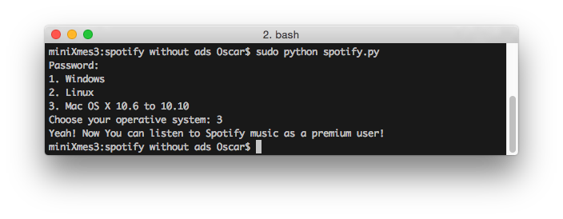

# Spotify Script #
----------

With this script you can listen Spotify music without advertising. It doesn't change your Spotify app so you're not doing anything ilegal. This scripts add a few URL to your hosts file to block the Spotify adsvertising.

# How it works #
----------

in **Linux** or **Mac OS X** run this comand in a shell/terminal

`sudo python spotify.py`

in **Windows**, first, run CMD as admin (right click on CMD icon and choose "Run as admin") and then write 

`python spotify.py`

...then select your OS and enjoy Spotify without ads!

